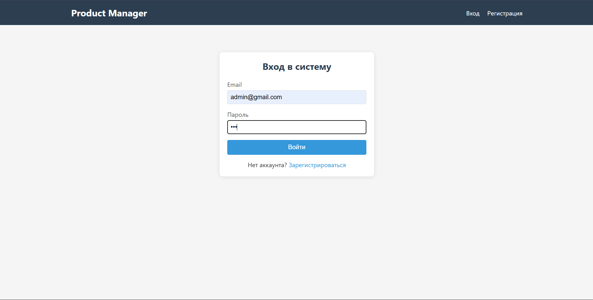
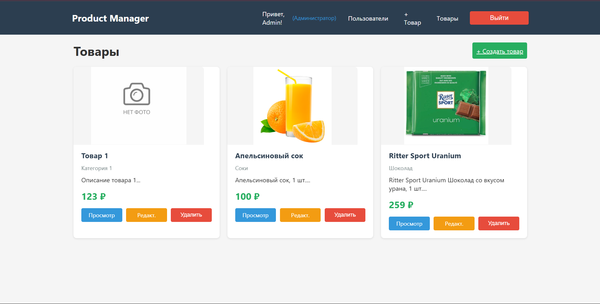
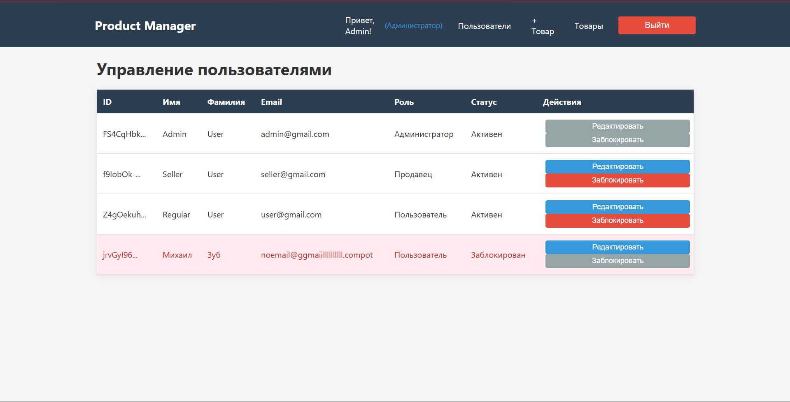

# Product Manager — Управление товарами с системой ролей (RBAC)

Веб-приложение для управления товарами с аутентификацией и разграничением прав доступа на основе ролей. Разработано в рамках практических занятий №7–11 по курсу «Фронтенд и бэкенд разработка».

---

## 📋 Оглавление

- [О проекте](#о-проекте)
- [Технологии](#технологии)
- [Функционал](#функционал)
- [Роли и права доступа](#роли-и-права-доступа)
- [API Endpoints](#api-endpoints)
- [Структура проекта](#структура-проекта)
- [Скриншоты](#скриншоты)

---

## 📝 О проекте

Учебное приложение для управления товарами, демонстрирующее ключевые концепции веб-разработки: аутентификацию с JWT, refresh-токены, хеширование паролей и систему ролевого доступа (RBAC).

### Ключевые особенности:
- ✅ Регистрация и вход пользователей
- ✅ JWT аутентификация с access/refresh токенами
- ✅ Ролевая модель (Admin, Seller, User, Guest)
- ✅ CRUD операции с товарами
- ✅ Управление пользователями (только Admin)
- ✅ Защита маршрутов на клиенте и сервере
- ✅ Swagger документация API
- ✅ Автоматическое обновление токенов (axios interceptors)

---

## 🛠 Технологии

### Frontend
| Технология | Версия | Описание |
|------------|--------|----------|
| React | 18.x | Библиотека для построения интерфейсов |
| React Router | 6.x | Маршрутизация в приложении |
| Axios | 1.x | HTTP клиент для запросов к API |
| CSS | — | Стилизация компонентов |

### Backend
| Технология | Версия | Описание |
|------------|--------|----------|
| Node.js | 18.x | Среда выполнения JavaScript |
| Express | 4.x | Веб-фреймворк для Node.js |
| JWT (jsonwebtoken) | — | Токены авторизации |
| Bcrypt | — | Хеширование паролей |
| nanoid | — | Генерация уникальных идентификаторов |
| Swagger | — | Документация API |
| CORS | — | Настройка междоменных запросов |

---

## 🎯 Функционал

### Для всех пользователей (включая гостей)
- Регистрация нового аккаунта
- Вход в существующий аккаунт

### Для авторизованных пользователей (User, Seller, Admin)
- Просмотр каталога товаров
- Просмотр детальной информации о товаре

### Для продавцов (Seller) и администраторов (Admin)
- Создание новых товаров
- Редактирование существующих товаров

### Только для администраторов (Admin)
- Просмотр списка всех пользователей
- Редактирование информации о пользователях
- Изменение ролей пользователей
- Блокировка пользователей
- Удаление товаров

---

## 🔐 Роли и права доступа

| Роль | Описание |
|------|----------|
| **Гость (Guest)** | Неаутентифицированный пользователь (доступ только к регистрации и входу) |
| **Пользователь (User)** | Обычный пользователь (только просмотр товаров) |
| **Продавец (Seller)** | Сотрудник сайта (создание и редактирование товаров) |
| **Администратор (Admin)** | Управленец сайта (права продавца + управление пользователями) |

### Матрица доступа

| Маршрут | Метод | Гость | User | Seller | Admin |
|---------|-------|:-----:|:----:|:------:|:-----:|
| `/api/auth/register` | POST | ✅ | ✅ | ✅ | ✅ |
| `/api/auth/login` | POST | ✅ | ✅ | ✅ | ✅ |
| `/api/auth/refresh` | POST | ✅ | ✅ | ✅ | ✅ |
| `/api/auth/me` | GET | ❌ | ✅ | ✅ | ✅ |
| `/api/users` | GET | ❌ | ❌ | ❌ | ✅ |
| `/api/users/:id` | GET | ❌ | ❌ | ❌ | ✅ |
| `/api/users/:id` | PUT | ❌ | ❌ | ❌ | ✅ |
| `/api/users/:id` | DELETE | ❌ | ❌ | ❌ | ✅ |
| `/api/products` | GET | ❌ | ✅ | ✅ | ✅ |
| `/api/products` | POST | ❌ | ❌ | ✅ | ✅ |
| `/api/products/:id` | GET | ❌ | ✅ | ✅ | ✅ |
| `/api/products/:id` | PUT | ❌ | ❌ | ✅ | ✅ |
| `/api/products/:id` | DELETE | ❌ | ❌ | ❌ | ✅ |

**Обозначения:**
- ✅ — доступ разрешён
- ❌ — доступ запрещён

---

## 🌐 API Endpoints

### Аутентификация (доступно всем)
| Метод | Endpoint | Описание |
|-------|----------|----------|
| POST | `/api/auth/register` | Регистрация нового пользователя |
| POST | `/api/auth/login` | Вход в систему |
| POST | `/api/auth/refresh` | Обновление пары токенов |
| GET | `/api/auth/me` | Получение информации о текущем пользователе |

### Управление пользователями (только администратор)
| Метод | Endpoint | Описание |
|-------|----------|----------|
| GET | `/api/users` | Получить список всех пользователей |
| GET | `/api/users/:id` | Получить пользователя по ID |
| PUT | `/api/users/:id` | Обновить информацию пользователя |
| DELETE | `/api/users/:id` | Заблокировать пользователя |

### Управление товарами
| Метод | Endpoint | Описание | Доступ |
|-------|----------|----------|--------|
| GET | `/api/products` | Получить список товаров | User/Seller/Admin |
| GET | `/api/products/:id` | Получить товар по ID | User/Seller/Admin |
| POST | `/api/products` | Создать товар | Seller/Admin |
| PUT | `/api/products/:id` | Обновить товар | Seller/Admin |
| DELETE | `/api/products/:id` | Удалить товар | Admin |


## 🏗️ Структура проекта

```
practice 11-12/
├── frontend/                # Frontend на React
│ ├── public/
│ ├── src/
│ │ ├── components/          # React компоненты
│ │ │ └── Navigation.js
│ │ ├── pages/               # Страницы приложения
│ │ │ ├── Login.js
│ │ │ ├── Register.js
│ │ │ ├── Products.js
│ │ │ ├── ProductDetail.js
│ │ │ ├── ProductForm.js
│ │ │ └── Users.js
│ │ ├── services/            # API сервисы
│ │ │ └── api.js
│ │ ├── App.css
│ │ └── App.js               # Корневой компонент
│ ├── package.json           # Зависимости клиента
│ └── README.md
├── app.js                   # Backend на Node.js + Express
├── package.json             # Зависимости сервера
├── README.md
└── .gitignore
```

## 📸 Скриншоты

### 1. Страница входа


### 2. Страница с товарами


### 3. Управление пользователями
