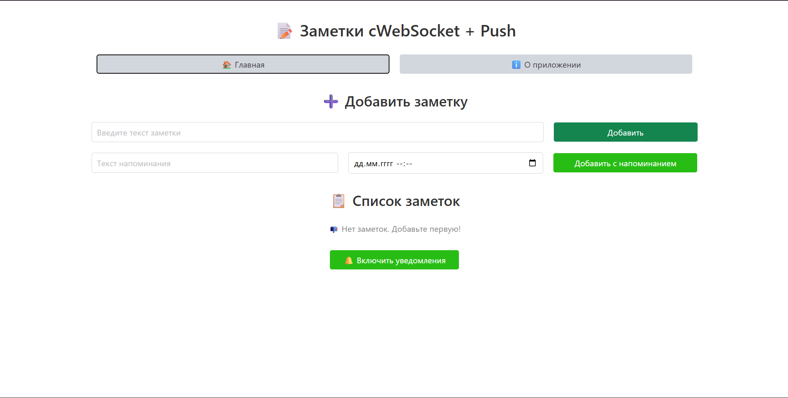
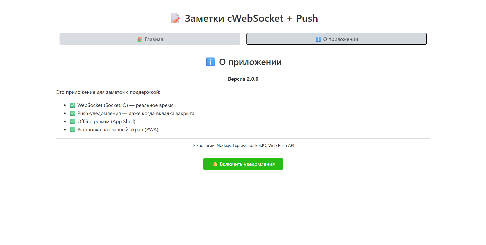
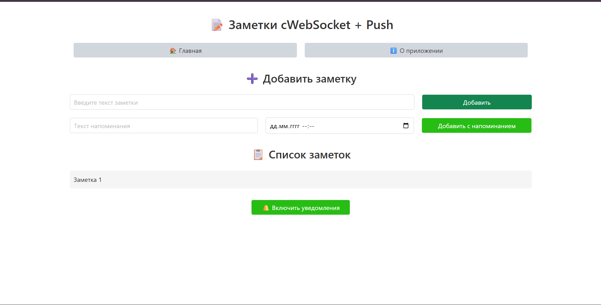
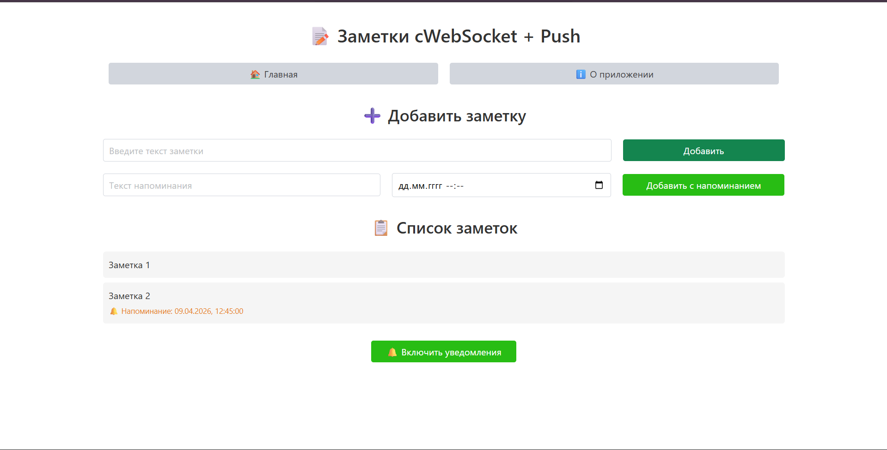
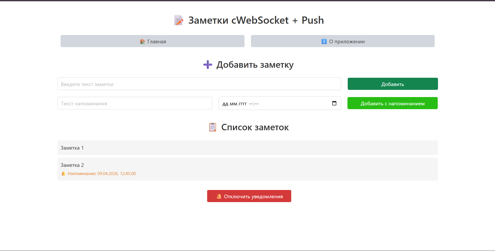
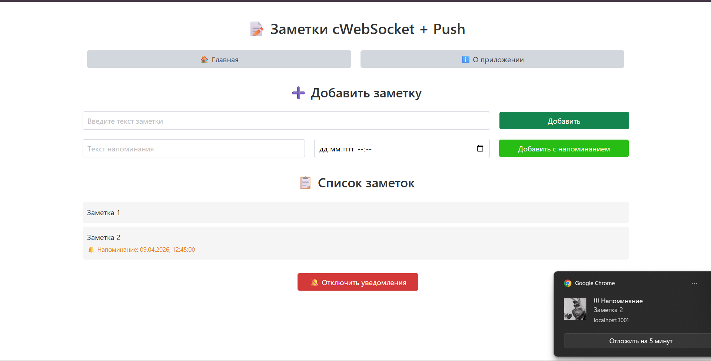
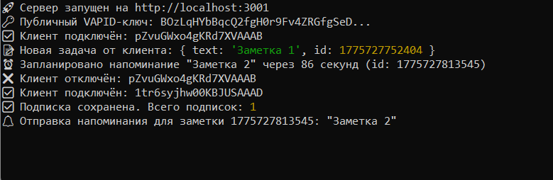

# Приложение заметок с WebSocket и Push-уведомлениями

---

## Описание проекта
Приложение для создания заметок с возможностью установки напоминаний и получения push-уведомлений.

## Функционал
- ✅ Создание обычных заметок
- ✅ Создание заметок с напоминанием (указание даты и времени)
- ✅ Real-time обновление через Socket.IO
- ✅ Push-уведомления при наступлении времени напоминания
- ✅ Кнопка "Отложить на 5 минут" в уведомлении
- ✅ PWA (работа офлайн, установка на экран)
- ✅ Service Worker для фоновой обработки уведомлений

## Технологии
- **Frontend**: HTML, CSS (Chota), JavaScript
- **Backend**: Node.js, Express, Socket.IO
- **Push-уведомления**: Web Push API, VAPID
- **PWA**: Service Worker, Manifest

---

## Структура проекта

```
├── server.js # Серверная часть (Express, Socket.IO, web-push)
├── app.js # Клиентская логика
├── sw.js # Service Worker (push, notificationclick, кэш)
├── index.html # Главная страница
├── manifest.json # PWA манифест
├── package.json # Зависимости проекта
├── content/
│   ├── home.html
│   └── about.html
└── icons/
	├── favicon.ico
	├── favicon-16x16.png
	├── favicon-32x32.png
	├── favicon-48x48.png
	├── favicon-64x64.png
	├── favicon-128x128.png
	├── favicon-256x256.png
	└── favicon-512x512.png
```

---

## Установка и запуск

### Требования
- Node.js (версия 14+)
- npm

### Установка зависимостей
```bash
npm install express socket.io web-push body-parser cors
```

### Запуск
```node server.js```

### Открытие
Перейдите по адресу: ``` http://localhost:3001 ```

---

# Тестирование

## Push-уведомления

1. Нажмите кнопку **"🔔 Включить уведомления"**
2. Разрешите уведомления в браузере (нажмите "Разрешить")
3. Создайте заметку с напоминанием на 1-2 минуты вперёд:
   - Введите текст напоминания
   - Выберите дату и время в будущем
   - Нажмите **"Добавить с напоминанием"**
4. Дождитесь наступления указанного времени
5. Должно прийти push-уведомление с текстом вашей заметки

## Кнопка "Отложить на 5 минут"

1. Дождитесь push-уведомления о напоминании
2. В самом уведомлении нажмите кнопку **"Отложить на 5 минут"**
3. Через 5 минут придёт новое уведомление с текстом "Напоминание отложено"

## Офлайн-режим

1. Отключите интернет
2. Перезагрузите страницу — она загрузится из кэша
3. Созданные заметки сохраняются в localStorage и никуда не исчезают

## Проверка работы при закрытом приложении

1. Закройте вкладку с приложением
2. Дождитесь времени напоминания
3. Уведомление всё равно придёт (Service Worker работает в фоне)

## Логи сервера

При успешной работе в консоли сервера должны отображаться сообщения:

- 🚀 Сервер запущен на http://localhost:3001
- ✅ Клиент подключён: xxx
- ⏰ Запланировано напоминание "Текст" через 60 секунд (id: 1234567890)
- 🔔 Отправка напоминания для заметки 1234567890: "Текст"
- ⏰ Напоминание 1234567890 отложено на 5 минут

---


## Скриншоты работы приложения

### 1. Главная страница 



### 2. Страница "О приложении"



### 3. Добавление обычной заметки



### 4. Добавление заметки с напоминанием (дата и время)



### 5. Включение уведомлений на сайте



### 6. Push уведомление



### 7. Сообщения в консоли браузера



---

## Реализованные практические задания

- ПЗ №13-14: PWA, Service Worker, кэширование

- ПЗ №15: WebSocket (Socket.IO)

- ПЗ №16: Push-уведомления, VAPID

- ПЗ №17: Напоминания, кнопка "Отложить"

- ПЗ №18: Тестирование, README