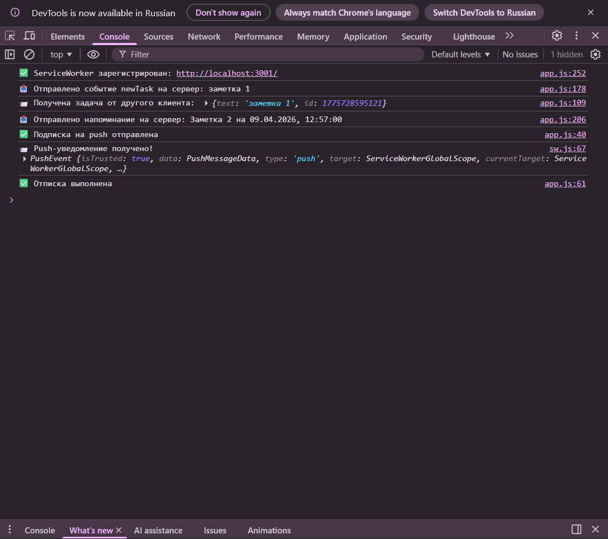

# Приложение заметок с WebSocket и Push-уведомлениями

## Реализованные практические задания

### ПЗ №13: Service Worker

**Цель:** Обеспечить базовую работу приложения в офлайн-режиме через кэширование статических ресурсов.

**Что сделано:**
- Зарегистрирован Service Worker
- Настроено кэширование статических файлов (HTML, CSS, JS) в `CACHE_NAME`
- Реализована стратегия Cache First для загрузки ресурсов
- Настроено сохранение заметок в `localStorage`
- Приложение полностью работает без интернета

---

### ПЗ №14: Web App Manifest

**Цель:** Добавить возможность установки приложения на устройство и настроить его внешний вид.

**Что сделано:**
- Создан файл `manifest.json` с полями: `name`, `short_name`, `start_url`, `display`, `background_color`, `theme_color`, `description`, `icons`
- Подготовлен набор иконок (16×16, 32×32, 48×48, 64×64, 128×128, 256×256, 512×512)
- Добавлены мета-теги для iOS (`apple-touch-icon`, `apple-mobile-web-app-status-bar-style`)
- Настроен цвет темы и фона
- Приложение можно установить на рабочий стол и запускать в отдельном окне

---

### ПЗ №15: HTTPS + App Shell

**Цель:** Обеспечить безопасное соединение (HTTPS) и реализовать архитектуру App Shell для мгновенной загрузки интерфейса.

**Что сделано:**
- Настроен локальный HTTPS-сервер с помощью `mkcert`
- Реализована архитектура App Shell (каркас приложения кэшируется, контент подгружается динамически)
- Создана структура `content/` с файлами `home.html` и `about.html`
- Реализована навигация через `loadContent()` с подгрузкой контента через `fetch`
- Настроена стратегия Network First для динамических страниц с фолбеком на кэш

---

### ПЗ №16: WebSocket + Push

**Цель:** Добавить двустороннюю связь в реальном времени и push-уведомления.

**Что сделано:**
- Установлены зависимости: `express`, `socket.io`, `web-push`, `body-parser`, `cors`
- Сгенерированы VAPID-ключи (публичный и приватный)
- Реализован сервер (`server.js`) с Socket.IO и эндпоинтами `/subscribe` и `/unsubscribe`
- На клиенте добавлены функции `subscribeToPush()` и `unsubscribeFromPush()`
- Добавлены кнопки включения/отключения уведомлений
- При добавлении заметки событие `newTask` рассылается всем клиентам через Socket.IO
- Push-уведомления отправляются всем подписанным пользователям

---

### ПЗ №17: Детализация Push (напоминания)

**Цель:** Реализовать гибкое управление push-уведомлениями с возможностью откладывания.

**Что сделано:**
- Добавлена форма для создания заметок с напоминанием (текст + `datetime-local`)
- Заметки содержат уникальный `id` и поле `reminder` (timestamp)
- На сервере создано хранилище `reminders` (Map) с таймерами (`setTimeout`)
- Реализовано планирование push-уведомлений на стороне сервера
- В Service Worker добавлена кнопка **«Отложить на 5 минут»** в уведомлении
- Добавлен обработчик `notificationclick` для действия `snooze`
- Реализован эндпоинт `POST /snooze` для переноса напоминания на 5 минут
- Напоминания работают даже при закрытом приложении

---

### ПЗ №18: Подготовка к контрольной работе №3

**Цель:** Протестировать приложение и подготовить репозиторий к сдаче.

**Что сделано:**
- Проведено полное тестирование всех функций приложения
- Проверена работа обычных заметок и заметок с напоминаниями
- Проверены push-уведомления и кнопка «Отложить на 5 минут»
- Проверена работа офлайн-режима и установка PWA
- Подготовлен корректный `README.md` с описанием проекта
- Репозиторий сделан публичным и готов к сдаче

---

## Описание проекта
Приложение для создания заметок с возможностью установки напоминаний и получения push-уведомлений.

## Функционал
- ✅ Создание обычных заметок
- ✅ Создание заметок с напоминанием (указание даты и времени)
- ✅ Real-time обновление через Socket.IO
- ✅ Push-уведомления при наступлении времени напоминания
- ✅ Кнопка "Отложить на 5 минут" в уведомлении
- ✅ PWA (работа офлайн, установка на экран)
- ✅ Service Worker для фоновой обработки уведомлений

## Технологии
- **Frontend**: HTML, CSS (Chota), JavaScript
- **Backend**: Node.js, Express, Socket.IO
- **Push-уведомления**: Web Push API, VAPID
- **PWA**: Service Worker, Manifest

---

## Структура проекта

```
├── server.js # Серверная часть (Express, Socket.IO, web-push)
├── app.js # Клиентская логика
├── sw.js # Service Worker (push, notificationclick, кэш)
├── index.html # Главная страница
├── manifest.json # PWA манифест
├── package.json # Зависимости проекта
├── content/
│   ├── home.html
│   └── about.html
└── icons/
	├── favicon.ico
	├── favicon-16x16.png
	├── favicon-32x32.png
	├── favicon-48x48.png
	├── favicon-64x64.png
	├── favicon-128x128.png
	├── favicon-256x256.png
	└── favicon-512x512.png
```

---

## Установка и запуск

### Требования
- Node.js (версия 14+)
- npm

### Установка зависимостей
```bash
npm install express socket.io web-push body-parser cors
```

### Запуск
```node server.js```

### Открытие
Перейдите по адресу: ``` http://localhost:3001 ```

---

# Тестирование

## Push-уведомления

1. Нажмите кнопку **"🔔 Включить уведомления"**
2. Разрешите уведомления в браузере (нажмите "Разрешить")
3. Создайте заметку с напоминанием на 1-2 минуты вперёд:
   - Введите текст напоминания
   - Выберите дату и время в будущем
   - Нажмите **"Добавить с напоминанием"**
4. Дождитесь наступления указанного времени
5. Должно прийти push-уведомление с текстом вашей заметки

## Кнопка "Отложить на 5 минут"

1. Дождитесь push-уведомления о напоминании
2. В самом уведомлении нажмите кнопку **"Отложить на 5 минут"**
3. Через 5 минут придёт новое уведомление с текстом "Напоминание отложено"

## Офлайн-режим

1. Отключите интернет
2. Перезагрузите страницу — она загрузится из кэша
3. Созданные заметки сохраняются в localStorage и никуда не исчезают

## Проверка работы при закрытом приложении

1. Закройте вкладку с приложением
2. Дождитесь времени напоминания
3. Уведомление всё равно придёт (Service Worker работает в фоне)

## Логи сервера

При успешной работе в консоли сервера должны отображаться сообщения:

- 🚀 Сервер запущен на http://localhost:3001
- ✅ Клиент подключён: xxx
- ⏰ Запланировано напоминание "Текст" через 60 секунд (id: 1234567890)
- 🔔 Отправка напоминания для заметки 1234567890: "Текст"
- ⏰ Напоминание 1234567890 отложено на 5 минут

---


## Скриншоты работы приложения

### 1. Главная страница 


### 2. Страница "О приложении"


### 3. Добавление обычной заметки


### 4. Добавление заметки с напоминанием (дата и время)


### 5. Включение уведомлений на сайте


### 6. Push уведомление


### 7. Сообщения в консоли браузера



### 8. Логи сервера


---